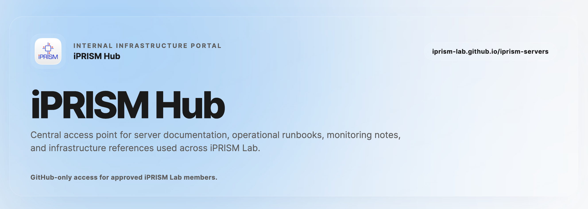

# iPRISM Hub

iPRISM Hub is the internal handbook for iPRISM Lab infrastructure. It contains server notes, operational documentation, tool handbooks, and shared access guidance.

## Open the Hub

Use the production site:

```txt
https://iprism-lab.github.io/iprism-servers/
```

Sign in with GitHub. Access is limited to approved iPRISM users and may require membership in the configured GitHub organization.

## Authentication

The Hub uses GitHub-only authentication. If access is denied, ask an administrator to verify your GitHub account and organization membership.

## Read Documentation

After signing in, use the sidebar to open server and operations pages. Extra Markdown files in `docs/` appear automatically under the Documentation section.

Approved users can also create and publish a standardized academic CV from **CV Builder**. Deployment setup is documented in `docs/cv-publishing.md`.

The contributor handbook is available inside the Hub as:

```txt
docs/hub-documentation.md
```

## Add a New Documentation Page

Most Hub content is plain Markdown.

1. Create a new `.md` file inside `docs/`.
2. Use a lowercase, hyphenated filename.
3. Start the file with one `#` heading.
4. Add sections with `##` and `###` headings.
5. Add images under `assets/<page-name>/`.
6. Commit and push the change.

Example:

```txt
docs/my-new-handbook.md
assets/my-new-handbook/image1.png
```

Reference the image from Markdown:

```md

```

The page will be rendered in the Hub as `My new handbook` under the Documentation section.

## Link to Another Page or Section

Use normal Markdown links.

Link to another documentation page:

```md
[Open the Portainer handbook](#doc-portainer)
```

Link to a section inside the same page:

```md
[Jump to Setup](#setup)
```

Then define the matching heading:

```md
## Setup
```

## Run Locally

Install dependencies and start the development server:

```bash
npm install
npm run dev
```

Open the local site shown by Vite, usually:

```txt
http://localhost:5173/iprism-servers/
```

## Useful Files

- `docs/`: Markdown handbook pages.
- `assets/`: local assets used by Markdown handbook pages.
- `public/tools.json`: dashboard cards, sidebar entries, tool links, and tool descriptions.
- `main.js`: Hub rendering, routing, authentication, and Markdown behavior.
- `cv-builder.js`: CV editor, autosave, photo upload, preview, and publication workflow.
- `supabase/`: CV schema, storage policies, static template, and publishing Edge Function.
- `style.css`: Hub styling.

## Banner Preview

The README banner preview page is:

```txt
https://iprism-lab.github.io/iprism-servers/readme-banner.html
```
